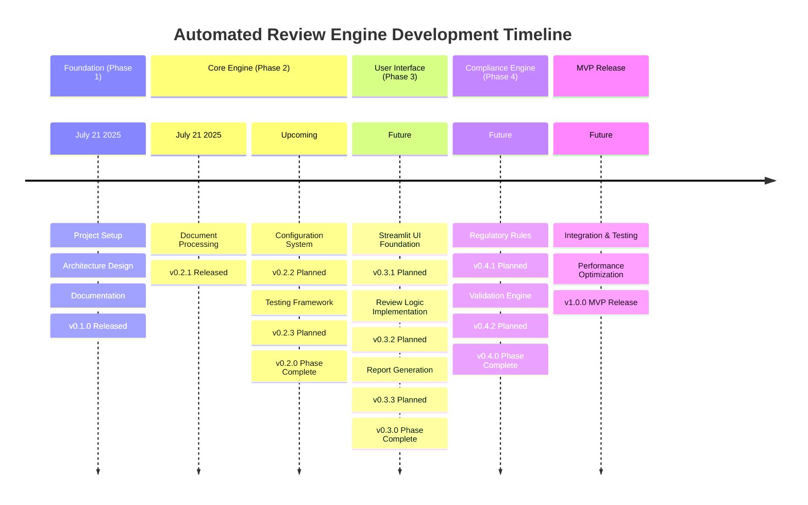

# Automated Review Engine - Git Graph

## Project Git Flow Visualization

### Main Development Flow
```mermaid
gitgraph
    commit id: "Project Init"
    commit id: "69433f3: Setup" tag: "v0.1.0"
    commit id: "d361437: Arch Docs"
    commit id: "cf2c585: Doc Processing" tag: "v0.2.1"
    commit id: "5981dfa: Git Docs"
    
    branch phase-2-2
    checkout phase-2-2
    commit id: "Config System" tag: "v0.2.2"
    checkout main
    merge phase-2-2
    
    branch phase-2-3
    checkout phase-2-3
    commit id: "Testing Suite" tag: "v0.2.3"
    checkout main
    merge phase-2-3
    commit id: "Phase 2 Done" tag: "v0.2.0"
    
    branch phase-3
    checkout phase-3
    commit id: "UI Foundation" tag: "v0.3.1"
    commit id: "Review Logic" tag: "v0.3.2"
    commit id: "Report Engine" tag: "v0.3.3"
    checkout main
    merge phase-3
    commit id: "Phase 3 Done" tag: "v0.3.0"
    
    branch phase-4
    checkout phase-4
    commit id: "Compliance Rules" tag: "v0.4.1"
    commit id: "Validation Engine" tag: "v0.4.2"
    checkout main
    merge phase-4
    commit id: "Phase 4 Done" tag: "v0.4.0"
    
    commit id: "Integration Tests"
    commit id: "Performance Tuning"
    commit id: "MVP Release" tag: "v1.0.0"
```

### Current Status (Detailed)
```mermaid
gitgraph
    commit id: "Initial Setup"
    commit id: "69433f3: Project Structure" type: HIGHLIGHT
    commit id: "d361437: Architecture Design" type: HIGHLIGHT
    commit id: "cf2c585: Document Processing" type: HIGHLIGHT
    commit id: "5981dfa: Git Strategy" type: NORMAL
    commit id: "Current Position" type: REVERSE
```

### Release Timeline


### Version Branching Strategy
```mermaid
gitgraph
    commit id: "main"
    
    branch release/v0.1.0
    checkout release/v0.1.0
    commit id: "Phase 1 Complete"
    commit id: "v0.1.0" tag: "v0.1.0"
    checkout main
    merge release/v0.1.0
    
    branch release/v0.2.0
    checkout release/v0.2.0
    commit id: "Phase 2.1"
    commit id: "v0.2.1" tag: "v0.2.1"
    commit id: "Phase 2.2"
    commit id: "v0.2.2" tag: "v0.2.2"
    commit id: "Phase 2.3"
    commit id: "v0.2.3" tag: "v0.2.3"
    commit id: "v0.2.0" tag: "v0.2.0"
    checkout main
    merge release/v0.2.0
    
    branch release/v1.0.0
    checkout release/v1.0.0
    commit id: "MVP Prep"
    commit id: "v1.0.0" tag: "v1.0.0"
    checkout main
    merge release/v1.0.0
```

## Tag Legend
- **v0.x.x**: Development versions
- **v1.0.0**: MVP release
- **v2.0.0**: Full feature release (future)

## Branch Types
- **main**: Stable, tested code
- **phase-x**: Feature development branches
- **release/vx.x.x**: Release preparation branches
- **hotfix/**: Emergency fixes (if needed)

## Commit Types
- **HIGHLIGHT**: Major milestones
- **NORMAL**: Regular development
- **REVERSE**: Current position
- **MERGE**: Branch merges
