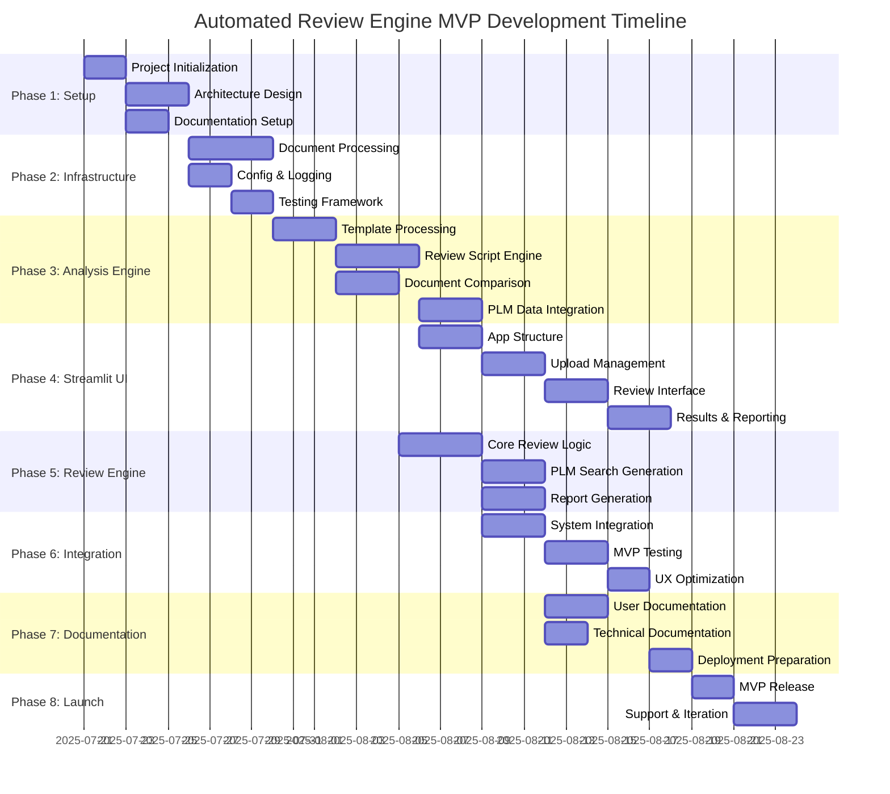

# Automated Review Engine (ARE) - Gantt Chart

## Gantt Chart Legend

### Phase Duration Overview
- **Phase 1 (Setup)**: ~5 days
- **Phase 2 (Infrastructure)**: ~6 days  
- **Phase 3 (Analysis Engine)**: ~8 days
- **Phase 4 (Streamlit UI)**: ~9 days
- **Phase 5 (Review Engine)**: ~7 days
- **Phase 6 (Integration)**: ~6 days
- **Phase 7 (Documentation)**: ~4 days
- **Phase 8 (Launch)**: ~3 days

### Critical Path for MVP
1. Project Initialization → Architecture Design → Document Processing
2. Document Processing → Template Processing → Review Script Engine
3. Review Script Engine → Core Review Logic → System Integration
4. System Integration → MVP Testing → MVP Release

### Parallel Workstreams
- UI development can start after review script engine is defined
- Documentation can be developed parallel to integration
- Testing framework setup can run parallel to core development
- PLM integration can develop parallel to document comparison

### Key Milestones
- ✅ **Project Setup Complete**: End of Phase 1
- 🔧 **Core Infrastructure Ready**: End of Phase 2
- 📄 **Document Processing Functional**: End of Phase 3
- 🖥️ **Streamlit UI Complete**: End of Phase 4
- � **Review Engine Operational**: End of Phase 5
- � **System Integration Complete**: End of Phase 6
- 📚 **Documentation Complete**: End of Phase 7
- 🚀 **MVP Launch**: End of Phase 8

### MVP Feature Dependencies
- Document processing must complete before template processing
- Review script engine depends on template processing
- UI development requires review engine definition
- Report generation depends on review logic completion
- System integration requires all core components

### Risk Mitigation
- Start with simple document formats (focus on structure over complex parsing)
- Implement basic review scripts before complex validation rules
- Test with sample regulatory documents early
- Prioritize core functionality over advanced features
